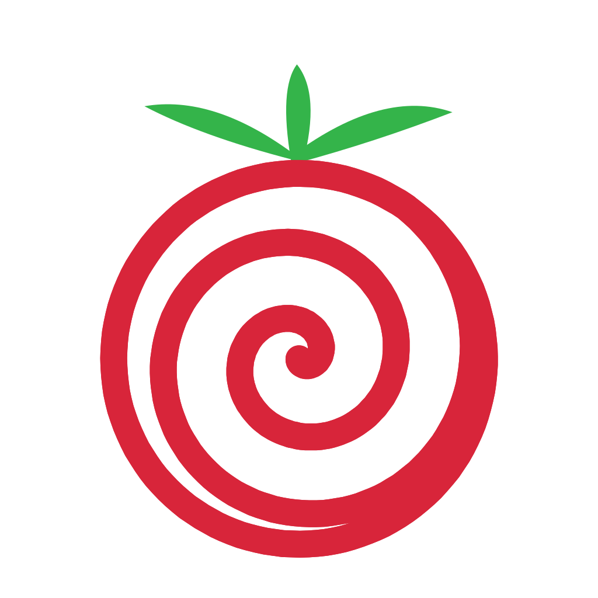

<p align="center">
  
</p>

# Pomodoro

A little timer that lives quietly at the top of your Mac screen and tells you when to work and when to rest, so you don't have to keep checking a clock.

|While you're working|While you're on break|
|---|---|
|||

## How it works

You work for 45 minutes, then take a 5 minute break. After doing that 3 times, you get a longer 15 minute break. Then it starts over. This is called the "Pomodoro Technique," a well-known way to stay focused without burning out.

You'll get a notification and a soft sound when it's time to switch from working to resting, or back.

## What it does for you

- **Reminds you to rest.** No more losing track of time and working for three hours straight.
- **Pauses itself during video calls.** If your camera turns on for a meeting, the timer notices and pauses automatically. No awkward break-time chime in the middle of a call. It resumes on its own once the call ends.
- **You can pause it anytime.** Click the icon in the menu bar and choose "Pause" whenever you need to step away.
- **Survives your computer sleeping.** Close your laptop, come back later, and it picks up cleanly instead of getting confused.

## Installing it (no coding needed)

1. Download the app from the [Releases page](../../releases/latest) — look for `Pomodoro.zip`.
2. Unzip it (double-click the file), and drag `Pomodoro.app` into your **Applications** folder.
3. Double-click to open it. Since it wasn't downloaded from the App Store, macOS blocks it and says it can't check it for malware. **That's expected, and the app is safe.** To let it run:
   - Open **System Settings → Privacy & Security**.
   - Scroll down to the **Security** section. You'll see a line saying "Pomodoro was blocked." Click **Open Anyway**, then enter your password.
   - If that button isn't there yet, try opening the app once first, then go back and look.
   - Still stuck? Open the **Terminal** app, paste `xattr -cr /Applications/Pomodoro.app`, press Return, then open the app normally.
4. Look at the top-right of your screen, next to the clock and wifi icon. You'll see a little smiley face, that's the timer.

That's it. It'll keep running in the background from now on. To make it start automatically every time you turn on your Mac, add it to **System Settings → General → Login Items**.

---

## For developers

The app is a single Python script (`pomodoro.py`) using PyObjC/AppKit for the native menu bar icon, packaged into a standalone `.app` with `py2app`.

### Requirements
- macOS
- Python 3 with `pyobjc` installed: `pip3 install pyobjc`

### Running from source

```bash
python3 pomodoro.py           # start
python3 pomodoro.py --toggle  # pause/resume a running instance
```

### Running as a background service (Launch Agent)

1. Edit `com.user.pomodoro.plist` and replace `/Users/YOUR_USER/path/to/pomodoro/` with your actual path.
2. Install it:

```bash
cp com.user.pomodoro.plist ~/Library/LaunchAgents/
launchctl bootstrap gui/$(id -u) ~/Library/LaunchAgents/com.user.pomodoro.plist
```

3. After editing `pomodoro.py`, restart the service:

```bash
launchctl kickstart -k gui/$(id -u)/com.user.pomodoro
```

### Building the standalone `.app`

```bash
pip3 install py2app
python3 setup.py py2app
```

Produces `dist/Pomodoro.app`. Zip it and attach it to a GitHub Release for non-technical distribution.

### Configuration

Session lengths and paths are constants at the top of `pomodoro.py`. There's no config file, just edit the script.

### Architecture

Two components run in parallel within a single process:

- **GUI thread (main):** `PomodoroStatusBar` class (subclasses `NSObject`), the native macOS menu bar icon. Polls pause state every 1s via `NSTimer`.
- **Timer thread (daemon):** `run_pomodoro()`, cycles through work/break sessions. Detects system wake via time jumps > 10s and restarts the cycle.

**IPC:** file-based flags in the home directory: `~/.pomodoro_paused` (manual pause), `~/.pomodoro_camera_paused` (auto-pause from a video call), `~/.pomodoro_break` (drives the "sleepy" icon during breaks). Camera state is polled via `ioreg -c IOAVCVideoDeviceType`.
